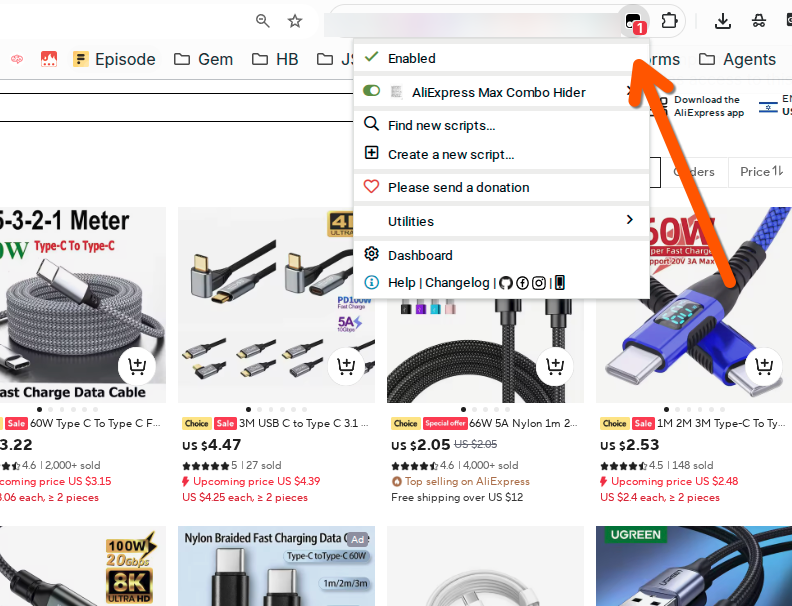
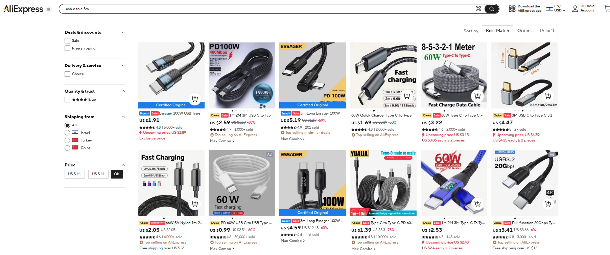
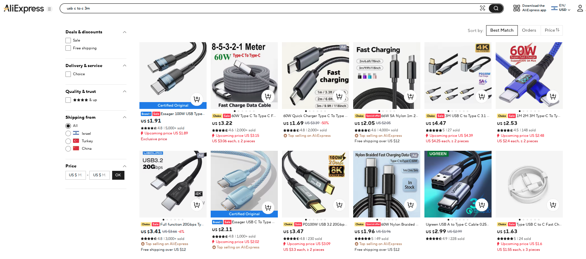
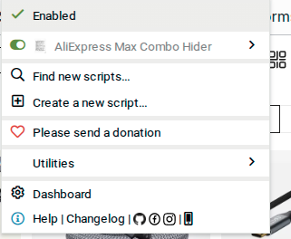

# AliExpress Max Combo Hider

A userscript that automatically hides "Max Combo" deal listings from AliExpress search results.

## What It Does

AliExpress frequently promotes "Max Combo" bundle deals in search results. These listings often clutter results when you're looking for individual items. This userscript automatically removes any product card marked with the "Max Combo" badge from search results.

## Before & After

**Before** - Search results cluttered with Max Combo deals:

**After** - Clean search results with combo deals hidden:

## Installation

### Prerequisites

You need a userscript manager browser extension. [Tampermonkey](https://www.tampermonkey.net/) is recommended and available for:

- Chrome
- Firefox
- Edge
- Safari
- Opera

### Install the Script

1. Install Tampermonkey from your browser's extension store
2. Click on the Tampermonkey icon and select "Create a new script"
3. Copy the contents of `aliexpress-combo-hider.user.js` and paste it into the editor
4. Save the script (Ctrl+S or File > Save)
5. Make sure the script is enabled in Tampermonkey

Alternatively, if this repository is hosted on GitHub, you can click on the raw `.user.js` file and Tampermonkey will offer to install it directly.

## How It Works

The script:

1. Monitors AliExpress pages for elements containing "Max Combo" text
2. When found, traverses the DOM to find the parent product card container
3. Removes the entire product card from the page
4. Uses both polling and MutationObserver to handle dynamically loaded content (infinite scroll)
5. Logs hidden items to the browser console for debugging

## Author

Daniel Rosehill
[GitHub](https://github.com/danielrosehill)

## License

MIT License
